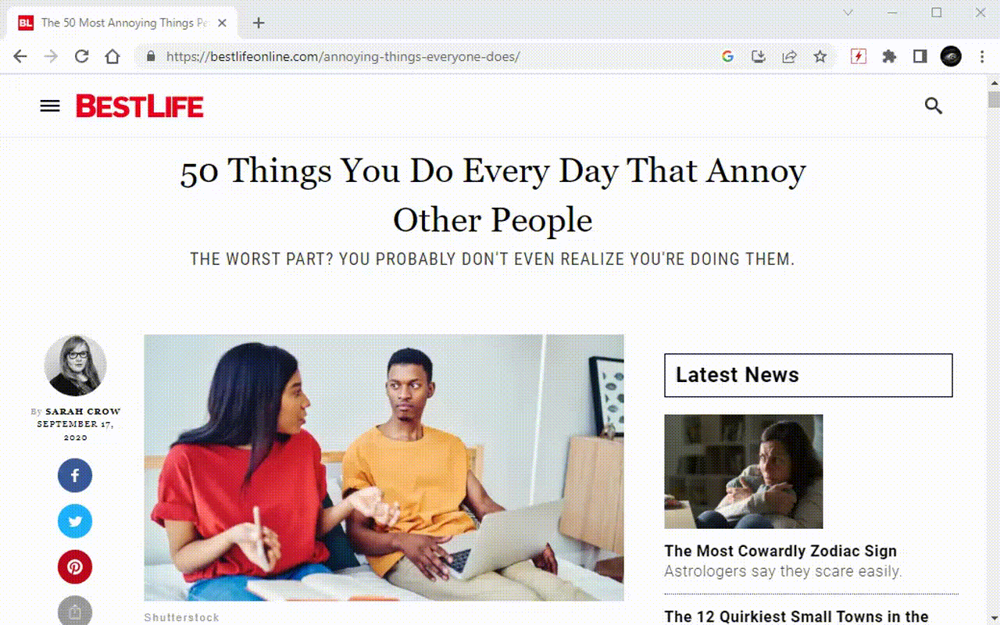

# ElementZapper
Zap/remove any element.

# Overview
Zap/remove any element.

Get rid of annoying things on the internet.
Hold SHIFT to continue zapping, or press ESC to quit zapper mode.

Credits to https://github.com/gorhill/uBlock for the screen-unlocking functionality. ;D

CHANGELOG: https://github.com/azrafe7/webClipElement/blob/main/CHANGELOG.md
